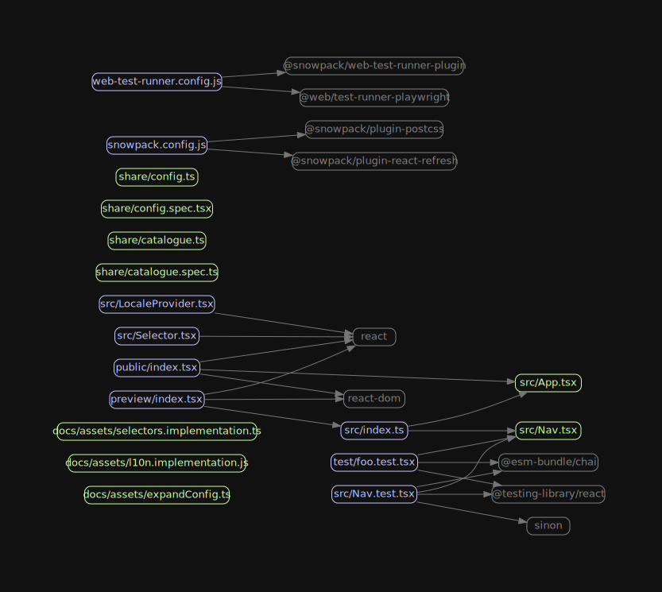

# Madge

This container makes
[madge](https://www.npmjs.com/package/madge) with Graphviz
available in order to generate your project dependency graph.

The container entrypoint is set to `madge` where you can pass specific
options such as:

```sh
docker run -ti --rm -v $(pwd):/tmp ghcr.io/zanona/madge:1 src -i image.svg
```

A default [`.madgerc` is provided](./.madgerc) in case your project directory doesn't have one.

This container runs a patched globally installed version of madge with the following changes:

- when generating a graph, npm modules will be grayed out.
- npm dependencies will have their names reduced to the package name;
  i.e: `node_modules/foo/dist/index.js` will be displayed as `foo`. Also, on
  typescript projects `@types/react/dist/index.js` will be renamed to `react`



### Ok, but I don't want those changes

In case you have `madge` locally installed as your project
dependency, it will use that version instead.

## Caveat

#### PNG Font

Keep in mind that for png/jpg graph generation it is going to use "Droid" font
since it's the one installed under this container image.

For a list of additional list of fonts which can be installed on alpine Linux,
please refer to https://wiki.alpinelinux.org/wiki/Fonts and make sure to
rebuild the Dockerfile containing those fonts.

#### GTS triangulation

I couldn't find the GTS package available on alpine, so at the moment it's not
possible to use the `sfdp` layout mode.

### Non Typescript project

Since the default config assumes a `tsconfig.json` file in your project.
In case it cannot find it, madge will possibly throw an error.
So you have two options:

1. Have your local `.madgerc` file which will be used instead
2. Run the command with the flag `--ts-config /dev/null`
